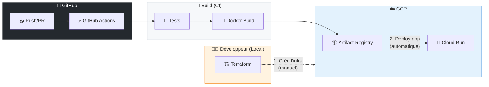

# Partie 4

# Store Parcel API - Part 4: Déploiement GCP

## Extension du Training - Cloud Run + MongoDB Atlas

**Prérequis:** Avoir complété les Parts 1, 2 et 3

**Objectif:** Déployer l'application sur Google Cloud Platform avec Cloud Run et MongoDB Atlas (tier gratuit M0).


---

## 1. Architecture Cloud

### 1.1 Vue d'Ensemble

```mermaidjs

flowchart LR
    subgraph Internet
        Client[👤 Client]
    end

    subgraph GCP["☁️ Google Cloud Platform"]
        subgraph CloudRun["Cloud Run"]
            API["🚀 Store Parcels API<br/>(Java 21)"]
        end

        subgraph VPC["VPC Network"]
            Connector["🔌 Serverless<br/>VPC Connector"]
            NAT["🌐 Cloud NAT<br/>(IP Statique)"]
        end
    end

    subgraph Atlas["🍃 MongoDB Atlas"]
        DB[(M0 Free Tier<br/>store_parcels_db)]
    end

    Client -->|HTTPS| API
    API <-->|Internal| Connector
    Connector --> NAT
    NAT -->|"IP Whitelistée<br/>34.78.x.x"| DB

    style GCP fill:#e3f2fd,stroke:#1976d2
    style VPC fill:#fff3e0,stroke:#f57c00
    style Atlas fill:#e8f5e9,stroke:#388e3c
    style CloudRun fill:#e1f5fe,stroke:#0288d1
```

### 1.2 Sécurité Réseau avec Cloud NAT

**Pourquoi Cloud NAT ?**

* Cloud Run n'a pas d'IP statique par défaut → impossible de whitelister dans Atlas
* Cloud NAT fournit une **IP de sortie statique** pour tout le trafic VPC
* Atlas peut whitelister **une seule IP** au lieu de 0.0.0.0/0
* **Sécurité renforcée** : seul votre projet GCP peut accéder à Atlas

**Flux réseau sécurisé:**


1. Cloud Run → Serverless VPC Connector (trafic interne)
2. VPC Connector → Cloud NAT (translation d'adresse)
3. Cloud NAT → Atlas (IP statique whitelistée)

### 1.3 Composants

| Service | Description | Tier / Coût |
|----|----|----|
| **Cloud Run** | Conteneur serverless Java | Free tier (2M req/mois) |
| **Artifact Registry** | Registry Docker | Free tier (0.5GB) |
| **MongoDB Atlas** | Base de données | M0 Free (512MB) |
| **Cloud Build** | CI/CD | Free tier (120 min/jour) |
| **Secret Manager** | Secrets | Free tier (6 versions) |
| **VPC Network** | Réseau privé | Gratuit |
| **Serverless VPC Connector** | Bridge Cloud Run → VPC | \~$7/mois (f1-micro x2) |
| **Cloud NAT** | IP statique sortante | \~$1/mois + $0.045/GB |
| **Cloud Router** | Routage NAT | Inclus avec NAT |
| **External IP** | IP statique | \~$3/mois (si non utilisée) |

### 1.4 Estimation des Coûts

**Configuration avec Cloud NAT (recommandée pour sécurité):**

* Cloud Run: 2 millions requests/mois gratuits
* Atlas M0: Gratuit (512MB storage, shared cluster)
* Artifact Registry: 0.5GB gratuit
* Serverless VPC Connector: \~$7/mois (2x f1-micro minimum)
* Cloud NAT + Router: \~$1-2/mois
* IP Statique: \~$3/mois (si infrastructure détruite le soir)
* **Total: \~$10-15/mois** pour configuration sécurisée

**⚠️ IMPORTANT - Terraform Destroy Obligatoire:**

* Pour réduire les coûts à \~0€/mois
* **Détruire l'infrastructure tous les soirs** via `terraform destroy`
* Recréer le matin via `terraform apply`
* Voir section 15 pour l'automatisation


---

## 2. Prérequis

### 2.1 Outils à Installer

```bash
# Google Cloud CLI
# macOS

brew install google-cloud-sdk

# Windows (via installer)
# https://cloud.google.com/sdk/docs/install

# Vérifier l'installation

gcloud version

# MongoDB Atlas CLI (optionnel mais utile)
brew install mongodb-atlas-cli
```

### 2.2 Comptes Requis


1. **Compte Google Cloud** avec billing activé (carte bancaire requise, mais free tier)
2. **Compte MongoDB Atlas** (gratuit)

### 2.3 Configuration GCloud (Activation APIs uniquement)

**⚠️ Seule commande gcloud autorisée - le reste passe par Terraform!**

```bash
# Authentification

gcloud auth login

# Sélectionner le projet (créé via Console ou Terraform)
gcloud config set project store-parcels-training

# Activer le billing (requis - via console)
# https://console.cloud.google.com/billing

# Activer les APIs nécessaires (SEULES commandes gcloud autorisées)
gcloud services enable \
  run.googleapis.com \
  artifactregistry.googleapis.com \
  cloudbuild.googleapis.com \
  secretmanager.googleapis.com \
  compute.googleapis.com \
  vpcaccess.googleapis.com
```

**Note:** L'activation des APIs peut aussi être faite via Terraform avec `google_project_service`, mais c'est souvent plus simple de le faire une fois manuellement.


---

## 3. Configuration MongoDB Atlas

### 3.1 Créer un Cluster M0


1. **Connecter à Atlas**: <https://cloud.mongodb.com>
2. **Créer un nouveau projet** (optionnel):
   * Nom: `store-parcels-training`
3. **Créer un cluster**:
   * Cliquer "Build a Database"
   * Sélectionner **M0 (Free)**
   * Provider: **Google Cloud**
   * Region: **europe-west1 (Belgium)** ou proche de votre Cloud Run
   * Cluster Name: `store-parcels-cluster`
4. **Créer un utilisateur Database**:
   * Username: `storeparcels_app`
   * Password: Générer un mot de passe fort (noter le!)
   * Role: `readWriteAnyDatabase`

### 3.2 Configurer l'Accès Réseau (via Terraform)

**⚠️ IMPORTANT: Ne jamais utiliser 0.0.0.0/0 en production!**

L'accès réseau Atlas est configuré **automatiquement par Terraform** (voir section 15.5 `atlas.tf`).

**Ce que Terraform fait automatiquement:**


1. Crée l'IP statique pour Cloud NAT
2. Configure l'IP Whitelist dans Atlas avec cette IP
3. Liaison automatique entre GCP et Atlas

**Vérification après** `**terraform apply**`**:**

```bash
# Voir l'IP NAT créée par Terraform

terraform output nat_ip_address
# → 34.78.xxx.xxx (cette IP est automatiquement whitelistée dans Atlas)
```

### 3.3 Récupérer la Connection String


1. Dans Atlas, cliquer "Connect" sur le cluster
2. Sélectionner "Connect your application"
3. Driver: Java, Version: 4.3+
4. Copier la connection string:

```
mongodb+srv://storeparcels_app:<password>@store-parcels-cluster.xxxxx.mongodb.net/?retryWrites=true&w=majority&appName=store-parcels-cluster
```


---

## 4. Adapter l'Application

### 4.1 Configuration Multi-Environnement

**application.yml:**

```yaml

spring:
  application:
    name: storeParcelsWS
  profiles:
    active: ${SPRING_PROFILES_ACTIVE:local}

server:
  port: ${PORT:8080}

---
# Profil local (Docker Compose)
spring:
  config:
    activate:
      on-profile: local
  data:
    mongodb:
      uri: mongodb://localhost:27017
      database: store_parcels_db

---
# Profil Docker (pour docker-compose)
spring:
  config:
    activate:
      on-profile: docker
  data:
    mongodb:
      uri: mongodb://mongodb:27017
      database: store_parcels_db

---
# Profil GCP Cloud Run

spring:
  config:
    activate:
      on-profile: gcp
  data:
    mongodb:
      uri: ${MONGODB_URI}
      database: ${MONGODB_DATABASE:store_parcels_db}

# Optimisations Cloud Run

management:
  endpoint:
    health:
      probes:
        enabled: true
  health:
    livenessState:
      enabled: true
    readinessState:
      enabled: true
```

### 4.2 Optimisations pour Cloud Run

**Startup rapide - Désactiver lazy initialization:**

```yaml
# application-gcp.yml

spring:
  main:
    lazy-initialization: false  # Startup plus prévisible

# Optimisation JVM pour containers
```

**Dockerfile optimisé pour Cloud Run:**

```dockerfile
# Build stage

FROM eclipse-temurin:21-jdk-alpine AS builder

WORKDIR /app

# Copy maven wrapper and pom

COPY mvnw .
COPY .mvn .mvn

COPY pom.xml .

# Download dependencies (cached layer)
RUN ./mvnw dependency:go-offline -B

# Copy source and build

COPY src src

RUN ./mvnw package -DskipTests -B

# Extract layers for better caching

RUN java -Djarmode=layertools -jar target/*.jar extract --destination extracted

# Runtime stage

FROM eclipse-temurin:21-jre-alpine

# Create non-root user

RUN addgroup -S spring && adduser -S spring -G spring

USER spring:spring

WORKDIR /app

# Copy layers in order of change frequency

COPY --from=builder /app/extracted/dependencies/ ./
COPY --from=builder /app/extracted/spring-boot-loader/ ./
COPY --from=builder /app/extracted/snapshot-dependencies/ ./
COPY --from=builder /app/extracted/application/ ./

# Cloud Run uses PORT env variable

ENV PORT=8080

EXPOSE 8080

# JVM optimizations for containers

ENV JAVA_OPTS="-XX:+UseContainerSupport \
               -XX:MaxRAMPercentage=75.0 \
               -XX:InitialRAMPercentage=50.0 \
               -Djava.security.egd=file:/dev/./urandom \
               -Dspring.profiles.active=gcp"

ENTRYPOINT ["sh", "-c", "java $JAVA_OPTS org.springframework.boot.loader.launch.JarLauncher"]
```

### 4.3 Health Checks pour Cloud Run

**HealthController.java:**

```java
@RestController
@RequestMapping("/store_parcels")
public class HealthController {

    private final MongoTemplate mongoTemplate;

    public HealthController(MongoTemplate mongoTemplate) {
        this.mongoTemplate = mongoTemplate;
    }

    @GetMapping("/health")
    public ResponseEntity<Map<String, Object>> health() {
        Map<String, Object> health = new HashMap<>();
        health.put("status", "UP");
        health.put("timestamp", System.currentTimeMillis());
        return ResponseEntity.ok(health);
    }

    // Liveness probe - l'app est-elle vivante?
    @GetMapping("/health/live")
    public ResponseEntity<Map<String, String>> liveness() {
        return ResponseEntity.ok(Map.of("status", "UP"));
    }

    // Readiness probe - l'app est-elle prête à recevoir du trafic?
    @GetMapping("/health/ready")
    public ResponseEntity<Map<String, Object>> readiness() {
        try {
            // Vérifier la connexion MongoDB
            mongoTemplate.getDb().runCommand(new Document("ping", 1));
            return ResponseEntity.ok(Map.of(
                "status", "UP",
                "mongodb", "connected"
            ));
        } catch (Exception e) {
            return ResponseEntity.status(503).body(Map.of(
                "status", "DOWN",
                "mongodb", "disconnected",
                "error", e.getMessage()
            ));
        }
    }
}
```


---

## 5. Infrastructure (100% Terraform)

**⚠️ RÈGLE ABSOLUE: Aucune commande gcloud pour créer des ressources!**

Toute l'infrastructure est créée via Terraform (section 15):

* **VPC + Subnet**: `gcp-network.tf`
* **Cloud NAT + Router + IP statique**: `gcp-network.tf`
* **Serverless VPC Connector**: `gcp-network.tf`
* **Artifact Registry**: `gcp-cloudrun.tf`
* **Secret Manager**: `gcp-secrets.tf`
* **Cloud Run**: `gcp-cloudrun.tf`
* **MongoDB Atlas** (Projet, Cluster, User, IP Whitelist): `atlas.tf`

### 5.1 Déploiement de l'Infrastructure

```bash

cd terraform

# Initialiser Terraform

terraform init

# Voir le plan

terraform plan

# Créer toute l'infrastructure

terraform apply

# Voir les outputs

terraform output
```

### 5.2 Vérifier l'Infrastructure (via Terraform outputs)

```bash
# URL Cloud Run

terraform output cloud_run_url

# IP NAT (whitelistée automatiquement dans Atlas)
terraform output nat_ip_address

# Registry Docker

terraform output artifact_registry

# VPC Connector

terraform output vpc_connector
```

### 5.3 Premier Build Docker (GitHub Actions)

**Le build et push Docker est fait par GitHub Actions (section 16).**

Après `terraform apply`, l'Artifact Registry existe. Le premier déploiement:


1. Push sur `main` → GitHub Actions se déclenche
2. Build Docker → Push vers Artifact Registry
3. Deploy vers Cloud Run (via `google-github-actions/deploy-cloudrun`)

**Pour debug local uniquement:**

```bash
# Configurer Docker pour Artifact Registry

gcloud auth configure-docker europe-west1-docker.pkg.dev

# Build et push manuellement (debug uniquement!)
REGISTRY=$(terraform output -raw artifact_registry)
docker build -t $REGISTRY/store-parcels-api:v1 .
docker push $REGISTRY/store-parcels-api:v1
```

### 5.4 Vérifier le Déploiement

```bash
# Récupérer l'URL via Terraform

CLOUD_RUN_URL=$(terraform output -raw cloud_run_url)

# Test health

curl $CLOUD_RUN_URL/store_parcels/health

# Test readiness

curl $CLOUD_RUN_URL/store_parcels/health/ready

# Test search (avec données)
curl -X POST $CLOUD_RUN_URL/store_parcels/search \
  -H "Content-Type: application/json" \
  -d '{
    "criterias": [{"field": "deliveryStoreId", "operator": "EQ", "value": "ST001"}],
    "pagination": {"page": 1, "pageSize": 10}
  }'
```


---

## 6. Charger les Données de Test

### 6.1 Classe Java pour Génération de Données

**src/main/java/com/kantic/storeparcels/util/TestDataGenerator.java:**

```java

package com.kantic.storeparcels.util;

import com.kantic.storeparcels.model.Customer;
import com.kantic.storeparcels.model.Parcel;
import com.kantic.storeparcels.model.StorageLocation;
import org.springframework.data.mongodb.core.MongoTemplate;
import org.springframework.data.mongodb.core.index.Index;
import org.springframework.data.domain.Sort;
import org.springframework.stereotype.Component;

import java.time.LocalDateTime;
import java.util.ArrayList;
import java.util.List;
import java.util.Random;

@Component

public class TestDataGenerator {

    private static final String[] STORES = {"ST001", "ST002", "ST003", "ST004", "ST005",
                                             "ST006", "ST007", "ST008", "ST009", "ST010"};
    private static final String[] STATUSES = {"READY_FOR_PICKUP", "IN_TRANSIT", "DELIVERED", "EXPIRED"};
    private static final String[] FIRST_NAMES = {"John", "Jane", "Michael", "Sarah", "David",
                                                  "Emma", "Robert", "Lisa", "James", "Maria",
                                                  "William", "Anna", "Richard", "Sophie", "Thomas",
                                                  "Emily", "Charles", "Olivia", "Daniel", "Isabella"};
    private static final String[] LAST_NAMES = {"Smith", "Johnson", "Williams", "Brown", "Jones",
                                                 "Garcia", "Miller", "Davis", "Rodriguez", "Martinez",
                                                 "Hernandez", "Lopez", "Wilson", "Anderson", "Thomas",
                                                 "Taylor", "Moore", "Jackson", "Martin", "Lee"};

    // Pour M0 Atlas, limiter à 10,000 documents (stockage limité 512MB)
    private static final int PARCEL_COUNT = 10_000;
    private static final int BATCH_SIZE = 1000;

    private final MongoTemplate mongoTemplate;
    private final Random random = new Random();

    public TestDataGenerator(MongoTemplate mongoTemplate) {
        this.mongoTemplate = mongoTemplate;
    }

    public void generateTestData() {
        System.out.println("=== Generating " + PARCEL_COUNT + " test parcels ===");

        List<Parcel> batch = new ArrayList<>(BATCH_SIZE);

        for (int i = 1; i <= PARCEL_COUNT; i++) {
            Parcel parcel = createRandomParcel(i);
            batch.add(parcel);

            if (batch.size() >= BATCH_SIZE) {
                mongoTemplate.insertAll(batch);
                System.out.printf("Inserted batch %d/%d%n",
                    i / BATCH_SIZE, (PARCEL_COUNT + BATCH_SIZE - 1) / BATCH_SIZE);
                batch.clear();
            }
        }

        // Insert remaining
        if (!batch.isEmpty()) {
            mongoTemplate.insertAll(batch);
        }

        System.out.println("Total: " + PARCEL_COUNT + " parcels inserted");

        createIndexes();
    }

    private Parcel createRandomParcel(int index) {
        String storeId = STORES[random.nextInt(STORES.length)];
        String status = STATUSES[random.nextInt(STATUSES.length)];
        String firstName = FIRST_NAMES[random.nextInt(FIRST_NAMES.length)];
        String lastName = LAST_NAMES[random.nextInt(LAST_NAMES.length)];

        Parcel parcel = new Parcel();
        parcel.setParcelId(String.format("P%06d", index));
        parcel.setOrderId(String.format("ORD%06d", random.nextInt(100000)));
        parcel.setPickupStoreId(storeId);
        parcel.setStatus(status);
        parcel.setStatusUpdateDate(LocalDateTime.now().minusDays(random.nextInt(30)));
        parcel.setExpirationDate(LocalDateTime.now().plusDays(random.nextInt(60)));
        parcel.setIsExpired(random.nextDouble() > 0.9);
        parcel.setIsPaid(random.nextDouble() > 0.1);

        Customer customer = new Customer();
        customer.setFirstName(firstName);
        customer.setLastName(lastName);
        customer.setEmail(firstName.toLowerCase() + "." + lastName.toLowerCase() + "@example.com");
        customer.setPhoneNumber("+33" + (100000000 + random.nextInt(900000000)));
        parcel.setCustomer(customer);

        StorageLocation location = new StorageLocation();
        location.setStoreId(storeId);
        location.setLocationCode("RACK-" + (char)('A' + random.nextInt(5)) + "-" + (1 + random.nextInt(50)));
        parcel.setStorageLocation(location);

        return parcel;
    }

    private void createIndexes() {
        System.out.println("Creating indexes...");

        mongoTemplate.indexOps(Parcel.class).ensureIndex(
            new Index().on("parcelId", Sort.Direction.ASC).unique()
        );
        mongoTemplate.indexOps(Parcel.class).ensureIndex(
            new Index().on("pickupStoreId", Sort.Direction.ASC)
                       .on("status", Sort.Direction.ASC)
                       .on("expirationDate", Sort.Direction.ASC)
        );
        mongoTemplate.indexOps(Parcel.class).ensureIndex(
            new Index().on("customer.firstName", Sort.Direction.ASC)
                       .on("customer.lastName", Sort.Direction.ASC)
        );
        mongoTemplate.indexOps(Parcel.class).ensureIndex(
            new Index().on("orderId", Sort.Direction.ASC)
        );

        System.out.println("Indexes created");
    }
}
```

### 6.2 Endpoint pour Déclencher la Génération

**Ajouter dans un contrôleur (dev/test uniquement):**

```java
@RestController
@RequestMapping("/store_parcels/admin")
@Profile({"local", "docker"})  // Désactivé en production (gcp)
public class AdminController {

    private final TestDataGenerator testDataGenerator;
    private final MongoTemplate mongoTemplate;

    public AdminController(TestDataGenerator testDataGenerator, MongoTemplate mongoTemplate) {
        this.testDataGenerator = testDataGenerator;
        this.mongoTemplate = mongoTemplate;
    }

    @PostMapping("/generate-test-data")
    public ResponseEntity<Map<String, Object>> generateTestData() {
        // Vider la collection existante
        mongoTemplate.dropCollection(Parcel.class);

        // Générer les données
        testDataGenerator.generateTestData();

        long count = mongoTemplate.count(new Query(), Parcel.class);
        return ResponseEntity.ok(Map.of(
            "status", "success",
            "parcelsGenerated", count,
            "message", "Test data generated successfully"
        ));
    }

    @DeleteMapping("/clear-data")
    public ResponseEntity<Map<String, String>> clearData() {
        mongoTemplate.dropCollection(Parcel.class);
        return ResponseEntity.ok(Map.of(
            "status", "success",
            "message", "All parcels deleted"
        ));
    }
}
```

### 6.3 Exécuter la Génération

**Option A: Via l'API REST (recommandé)**

```bash
# En local ou Docker

curl -X POST http://localhost:8080/store_parcels/admin/generate-test-data

# Réponse attendue:
# {"status":"success","parcelsGenerated":10000,"message":"Test data generated successfully"}
```

**Option B: Via CommandLineRunner (au démarrage)**

```java
@Component
@Profile("generate-data")  // Activé uniquement avec ce profil

public class DataInitializer implements CommandLineRunner {

    private final TestDataGenerator testDataGenerator;

    public DataInitializer(TestDataGenerator testDataGenerator) {
        this.testDataGenerator = testDataGenerator;
    }

    @Override
    public void run(String... args) {
        testDataGenerator.generateTestData();
    }
}
```

```bash
# Lancer avec le profil generate-data

SPRING_PROFILES_ACTIVE=local,generate-data ./mvnw spring-boot:run
```

**Option C: Pour Atlas (après déploiement Cloud Run)**

```bash
# Temporairement activer l'endpoint admin en GCP (déconseillé en prod)
# Ou utiliser un job Cloud Run séparé

# Alternative: Utiliser mongosh avec une connexion locale qui passe par le même code
# mais exécuté depuis un environnement avec accès à Atlas
```


---

## 7. Monitoring et Logs

### 7.1 Cloud Logging (via Console)

**Accès aux logs via GCP Console:**


1. Ouvrir [Cloud Logging](https://console.cloud.google.com/logs)
2. Filtrer par: `resource.type="cloud_run_revision"` et `resource.labels.service_name="store-parcels-api"`
3. Ou utiliser le lien direct depuis Cloud Run → Logs

**Requête de logs utile:**

```
resource.type="cloud_run_revision"
resource.labels.service_name="store-parcels-api"
severity>=ERROR
```

### 7.2 Cloud Monitoring

Configurer des alertes dans la console GCP:


1. Monitoring → Alerting → Create Policy
2. Metrics:
   * `run.googleapis.com/request_latencies` (P95 > 60ms)
   * `run.googleapis.com/request_count` avec filter `response_code>=500`

### 7.3 Atlas Monitoring

Dans Atlas Console:


1. Cluster → Metrics
2. Surveiller:
   * Operations/sec
   * Query Targeting (devrait être proche de 1.0)
   * Connections
   * Storage Used


---

## 8. Performance Testing sur Cloud

### 8.1 Adapter Gatling pour Cloud Run (avec Warmup)

**⚠️ IMPORTANT: Phase de Warmup obligatoire**

Avec `min-instances=0` (scale to zero), le premier appel déclenche un **cold start** (2-5 secondes). La phase de warmup permet de:


1. Réveiller l'instance Cloud Run
2. Initialiser la connexion MongoDB Atlas
3. Charger le contexte Spring Boot
4. **Exclure le cold start des métriques P95**

**ParcelSearchSimulationCloud.scala:**

```scala

package storeparcel

import io.gatling.core.Predef._

import io.gatling.http.Predef._

import scala.concurrent.duration._

import scala.util.Random

class ParcelSearchSimulationCloud extends Simulation {

  // URL Cloud Run (variable d'environnement)
  val cloudRunUrl = System.getenv("CLOUD_RUN_URL")

  val httpProtocol = http
    .baseUrl(cloudRunUrl)
    .acceptHeader("application/json")
    .contentTypeHeader("application/json")
    .shareConnections

  // ============================================
  // FEEDERS POUR LA VARIANCE (éviter cache hits)
  // ============================================

  // Feeder pour les stores (ST001 à ST010)
  val storeFeeder = Iterator.continually(Map(
    "storeId" -> s"ST${"%03d".format(Random.nextInt(10) + 1)}"
  ))

  // Feeder pour les statuts
  val statuses = Array("PENDING", "IN_TRANSIT", "READY_FOR_PICKUP", "PICKED_UP",
                       "DELIVERED", "CANCELLED", "RETURNED", "EXPIRED")
  val statusFeeder = Iterator.continually(Map(
    "status" -> statuses(Random.nextInt(statuses.length))
  ))

  // Feeder pour pagination aléatoire
  val paginationFeeder = Iterator.continually(Map(
    "page" -> (Random.nextInt(10) + 1),      // Pages 1-10
    "pageSize" -> (10 + Random.nextInt(41))   // 10-50 résultats
  ))

  // Feeder combiné pour recherches multi-critères
  val multiCriteriaFeeder = Iterator.continually(Map(
    "storeId" -> s"ST${"%03d".format(Random.nextInt(10) + 1)}",
    "status1" -> statuses(Random.nextInt(statuses.length)),
    "status2" -> statuses(Random.nextInt(statuses.length)),
    "page" -> (Random.nextInt(5) + 1),
    "pageSize" -> (10 + Random.nextInt(21))
  ))

  // Feeder pour recherche par client (noms aléatoires)
  val firstNames = Array("John", "Jane", "Michael", "Sarah", "David", "Emma",
                         "Robert", "Lisa", "James", "Maria")
  val customerFeeder = Iterator.continually(Map(
    "firstName" -> firstNames(Random.nextInt(firstNames.length))
  ))

  // ============================================
  // PHASE 1: WARMUP (exclue des assertions P95)
  // ============================================
  val warmupScenario = scenario("Warmup - Cold Start")
    // Étape 1: Réveiller Cloud Run
    .exec(
      http("Warmup - Health Check")
        .get("/store_parcels/health")
        .check(status.is(200))
    )
    .pause(3.seconds)

    // Étape 2: Initialiser connexion MongoDB
    .exec(
      http("Warmup - Readiness")
        .get("/store_parcels/health/ready")
        .check(status.is(200))
        .check(jsonPath("$.mongodb").is("connected"))
    )
    .pause(2.seconds)

    // Étape 3: Chauffer le JIT avec requêtes variées
    .repeat(5) {
      feed(storeFeeder)
      .exec(
        http("Warmup - Search")
          .post("/store_parcels/search")
          .body(StringBody("""{"criterias":[{"field":"deliveryStoreId","operator":"EQ","value":"${storeId}"}],"pagination":{"page":1,"pageSize":10}}"""))
          .check(status.is(200))
      )
      .pause(500.milliseconds)
    }
    .pause(2.seconds)

  // ============================================
  // PHASE 2: TESTS DE PERFORMANCE AVEC VARIANCE
  // ============================================

  // Scénario 1: Recherche par store (variance sur storeId + pagination)
  val searchByStore = scenario("Search by Store")
    .feed(storeFeeder)
    .feed(paginationFeeder)
    .exec(
      http("Search Store")
        .post("/store_parcels/search")
        .body(StringBody(
          """{"criterias":[{"field":"deliveryStoreId","operator":"EQ","value":"${storeId}"}],"pagination":{"page":${page},"pageSize":${pageSize}}}"""
        ))
        .check(status.is(200))
        .check(jsonPath("$.page.totalElements").exists)
    )

  // Scénario 2: Recherche par statut (variance sur status + pagination)
  val searchByStatus = scenario("Search by Status")
    .feed(statusFeeder)
    .feed(paginationFeeder)
    .exec(
      http("Search Status")
        .post("/store_parcels/search")
        .body(StringBody(
          """{"criterias":[{"field":"parcelStatus","operator":"EQ","value":"${status}"}],"pagination":{"page":${page},"pageSize":${pageSize}}}"""
        ))
        .check(status.is(200))
    )

  // Scénario 3: Recherche multi-critères (variance complète)
  val searchMultiCriteria = scenario("Search Multi-Criteria")
    .feed(multiCriteriaFeeder)
    .exec(
      http("Search Store + Status")
        .post("/store_parcels/search")
        .body(StringBody(
          """{"criterias":[{"field":"deliveryStoreId","operator":"EQ","value":"${storeId}"},{"field":"parcelStatus","operator":"IN","value":["${status1}","${status2}"]}],"sorts":[{"field":"statusUpdateDate","order":"desc"}],"pagination":{"page":${page},"pageSize":${pageSize}}}"""
        ))
        .check(status.is(200))
    )

  // Scénario 4: Recherche par client (variance sur firstName)
  val searchByCustomer = scenario("Search by Customer")
    .feed(customerFeeder)
    .feed(paginationFeeder)
    .exec(
      http("Search Customer")
        .post("/store_parcels/search")
        .body(StringBody(
          """{"criterias":[{"field":"customer.firstName","operator":"LIKE","value":"${firstName}"}],"pagination":{"page":${page},"pageSize":${pageSize}}}"""
        ))
        .check(status.is(200))
    )

  // ============================================
  // CONFIGURATION D'EXÉCUTION
  // ============================================
  setUp(
    // Phase 1: Warmup (1 utilisateur, séquentiel)
    warmupScenario.inject(atOnceUsers(1))
      .andThen(
        // Phase 2: Tests de performance avec variance
        searchByStore.inject(
          rampUsers(10).during(20.seconds),
          constantUsersPerSec(4).during(60.seconds)
        ),
        searchByStatus.inject(
          nothingFor(5.seconds),
          rampUsers(10).during(20.seconds),
          constantUsersPerSec(4).during(60.seconds)
        ),
        searchMultiCriteria.inject(
          nothingFor(10.seconds),
          rampUsers(10).during(20.seconds),
          constantUsersPerSec(4).during(60.seconds)
        ),
        searchByCustomer.inject(
          nothingFor(15.seconds),
          rampUsers(10).during(20.seconds),
          constantUsersPerSec(3).during(60.seconds)
        )
      )
  )
  .protocols(httpProtocol)
  .assertions(
    // Assertions sur les scénarios de PERF uniquement (pas warmup)
    details("Search Store").responseTime.percentile(95).lt(60),
    details("Search Status").responseTime.percentile(95).lt(60),
    details("Search Store + Status").responseTime.percentile(95).lt(60),
    details("Search Customer").responseTime.percentile(95).lt(60),
    global.successfulRequests.percent.gt(99)
  )
}
```

**Variance implémentée:**

* **storeId**: ST001 à ST010 (10 valeurs)
* **status**: 8 statuts différents
* **pagination**: page 1-10, pageSize 10-50
* **customer.firstName**: 10 prénoms différents
* **Combinaisons multi-critères**: milliers de combinaisons possibles

**Pourquoi c'est important:**

* Évite les cache hits MongoDB (queries différentes)
* Teste différents index (store, status, customer)
* Simule un trafic réaliste avec variance naturelle
* Révèle les problèmes de performance sur différents chemins

### 8.2 Exécution des Tests Gatling

```bash
# Définir l'URL Cloud Run

export CLOUD_RUN_URL=$(terraform -chdir=terraform output -raw cloud_run_url)

# Lancer les tests
./bin/gatling.sh -s storeparcel.ParcelSearchSimulationCloud

# Ou avec Maven

mvn gatling:test -Dgatling.simulationClass=storeparcel.ParcelSearchSimulationCloud
```

**Résultat attendu:**

```
================================================================================
---- Global Information --------------------------------------------------------
> request count                                       1500 (OK=1500   KO=0     )
> min response time                                      8 (OK=8      KO=-     )
> max response time                                     85 (OK=85     KO=-     )
> mean response time                                    25 (OK=25     KO=-     )
> std deviation                                         12 (OK=12     KO=-     )
> response time 50th percentile                         22 (OK=22     KO=-     )
> response time 75th percentile                         32 (OK=32     KO=-     )
> response time 95th percentile                         48 (OK=48     KO=-     )  ✓ < 60ms
> response time 99th percentile                         65 (OK=65     KO=-     )
> mean requests/sec                                   18.5 (OK=18.5   KO=-     )
---- Response Time Distribution ------------------------------------------------
> t < 60 ms                                           1450 ( 97%)
> 60 ms <= t < 100 ms                                   50 (  3%)
> t >= 100 ms                                            0 (  0%)
> failed                                                 0 (  0%)
================================================================================
```

### 8.3 Objectif Performance Cloud: P95 <60ms

**IMPORTANT:** L'objectif de performance reste identique au local: **P95 <60ms**

**Configuration choisie:**

* `min-instances=0`: Scale to zero (économie maximale)
* `max-instances=1`: Pas de scaling horizontal
* **Warmup Gatling**: Exclut le cold start des métriques

**Gestion des Cold Starts:**

| Approche | Cold Start | Coût | P95 mesuré |
|----|----|----|----|
| `min-instances=1` | ❌ Aucun | \~$15/mois | Direct |
| `min-instances=0` + Warmup | ✅ 2-5s | \~$0/mois | Après warmup |

**Notre choix: Scale to 0 + Warmup Gatling**

* Cold start absorbé par la phase de warmup
* P95 mesuré uniquement sur les requêtes post-warmup
* Coût quasi-nul pour le training

**Défis spécifiques au cloud:**


1. **Cold Starts (avec scale to 0):**
   * Premier appel: 2-5 secondes (JVM + Spring + MongoDB)
   * **Solution:** Phase de warmup dans Gatling qui exclut ces requêtes du P95
   * Le warmup simule un "préchauffage" avant les vrais tests
2. **Latence réseau Atlas:**
   * Latence Cloud Run → Atlas M0: \~5-15ms en europe-west1
   * **Solution:** Choisir la même région pour Cloud Run et Atlas
   * Utiliser les index correctement (crucial avec M0)
3. **Atlas M0 Limitations:**
   * Shared cluster = performances variables
   * **Solution:** Optimiser les queries, limiter les résultats, utiliser la projection
4. **Une seule instance (pas de scaling):**
   * Concurrence limitée par `--concurrency 80`
   * **Solution:** Tests Gatling dimensionnés pour 1 instance (\~15-20 req/s max)

**JVM Optimizations pour P95 stable:**

```dockerfile

ENV JAVA_OPTS="-XX:+UseContainerSupport \
               -XX:MaxRAMPercentage=75.0 \
               -XX:+UseG1GC \
               -XX:MaxGCPauseMillis=50 \
               -XX:+UseStringDeduplication \
               -Dspring.profiles.active=gcp"
```


---

## 9. Checkpoints Part 4

### Checkpoint 4.1: Prérequis configurés

**Validation:**

* Compte GCP avec billing activé
* Compte MongoDB Atlas créé
* APIs GCP activées (seule commande gcloud autorisée)
* Terraform installé

**Estimated Time:** 1 hour


---

### Checkpoint 4.2: Infrastructure Terraform déployée

**Validation:**

```bash

cd terraform

terraform init

terraform apply

# Vérifier les outputs

terraform output cloud_run_url

terraform output nat_ip_address

terraform output artifact_registry
```

**Success Criteria:**

* `terraform apply` sans erreur
* Cloud Run URL accessible
* IP NAT créée et whitelistée dans Atlas
* VPC Connector actif

**Estimated Time:** 2-3 hours


---

### Checkpoint 4.3: GitHub Actions CI/CD configuré

**Validation:**


1. Secrets GitHub configurés (`GCP_PROJECT_ID`, `GCP_SA_KEY` uniquement)
2. Push sur `main` → workflow déclenché
3. Image Docker buildée et pushée vers Artifact Registry
4. Cloud Run déployé automatiquement

**Note:** Terraform n'est PAS dans la CI - il est exécuté localement par le développeur.

**Success Criteria:**

* Workflow `deploy.yml` passe au vert
* Health check post-deploy réussi

**Estimated Time:** 2-3 hours


---

### Checkpoint 4.4: Application accessible

**Validation:**

```bash

CLOUD_RUN_URL=$(terraform -chdir=terraform output -raw cloud_run_url)

# Test health

curl $CLOUD_RUN_URL/store_parcels/health

# Test readiness (connexion MongoDB)
curl $CLOUD_RUN_URL/store_parcels/health/ready
```

**Success Criteria:**

* Health check répond 200
* Readiness confirme connexion MongoDB Atlas

**Estimated Time:** 30 min


---

### Checkpoint 4.5: Données chargées dans Atlas

**Validation:**

```bash
# Option A: Via l'endpoint admin (en local connecté à Atlas)
SPRING_PROFILES_ACTIVE=gcp MONGODB_URI="mongodb+srv://..." ./mvnw spring-boot:run

curl -X POST http://localhost:8080/store_parcels/admin/generate-test-data

# Option B: Vérifier le count via l'API search

curl -X POST http://localhost:8080/store_parcels/search \
  -H "Content-Type: application/json" \
  -d '{"criterias":[],"pagination":{"page":1,"pageSize":1}}'
# Vérifier "totalElements": 10000
```

**Success Criteria:**

* 10,000 documents insérés
* Index créés (via TestDataGenerator)
* Requêtes fonctionnent

**Estimated Time:** 1-2 hours


---

### Checkpoint 4.6: Tests de Performance Cloud - P95 <60ms

**Validation:**

```bash

export CLOUD_RUN_URL=$(terraform -chdir=terraform output -raw cloud_run_url)
./bin/gatling.sh -s storeparcel.ParcelSearchSimulationCloud
```

**Success Criteria:**

* Phase de warmup réussie (cold start absorbé)
* **P95 < 60ms** sur les scénarios de performance (post-warmup)
* Success rate > 99%

**Si P95 > 60ms après warmup, vérifier:**


1. Warmup suffisant? (augmenter les pauses/répétitions)
2. Région Atlas = Région Cloud Run (europe-west1)?
3. Index MongoDB créés correctement?

**Estimated Time:** 2-3 hours


---

### Checkpoint 4.7: Terraform Destroy fonctionne (local)

**Validation:**

```bash

cd terraform

terraform destroy

# Vérifier que tout est détruit

terraform state list  # Devrait être vide
```

**Success Criteria:**

* `terraform destroy` sans erreur (exécuté localement)
* Infrastructure complètement supprimée
* Scripts `terraform-apply.sh` et `terraform-destroy.sh` fonctionnels

**Note:** Terraform est exécuté uniquement en local, pas via GitHub Actions.

**Estimated Time:** 1 hour


---

## 10. Livrables Part 4

**Infrastructure Terraform (exécuté localement par le développeur):**

- [ ] `terraform/providers.tf` - Configuration providers GCP + Atlas
- [ ] `terraform/variables.tf` - Variables avec sensibilité
- [ ] `terraform/gcp-network.tf` - VPC, Cloud NAT, VPC Connector
- [ ] `terraform/atlas.tf` - Projet, Cluster M0, User, IP Whitelist
- [ ] `terraform/gcp-secrets.tf` - Secret Manager avec MongoDB URI
- [ ] `terraform/gcp-cloudrun.tf` - Cloud Run avec VPC Connector
- [ ] `terraform/gcp-iam.tf` - Service Account pour GitHub Actions
- [ ] `terraform/outputs.tf` - Outputs (URL, IP NAT, SA key, etc.)

**CI/CD GitHub Actions (déploiement applicatif uniquement):**

- [ ] `.github/workflows/ci.yml` - Tests sur chaque PR
- [ ] `.github/workflows/deploy.yml` - Build Docker + Deploy Cloud Run sur push main
- [ ] Service Account GCP configuré pour GitHub Actions (via Terraform local)
- [ ] Secrets GitHub configurés (`GCP_PROJECT_ID`, `GCP_SA_KEY` uniquement)

**Scripts Automatisation (exécutés localement):**

- [ ] `scripts/terraform-apply.sh` - Script de création infra
- [ ] `scripts/terraform-destroy.sh` - Script de destruction infra

**Application:**

- [ ] Dockerfile optimisé pour Cloud Run
- [ ] Health checks configurés

**Validation:**

- [ ] P95 < 60ms sur Cloud Run
- [ ] Cloud NAT fonctionnel (IP statique whitelistée dans Atlas)
- [ ] Terraform destroy fonctionne sans erreur
- [ ] Données de test chargées (10k)
- [ ] Documentation de déploiement


---

## 11. Critères d'Évaluation Part 4

| Critère | Poids |
|----|----|
| **Infrastructure Terraform complète** (GCP + Atlas, exécuté localement) | 25% |
| **CI/CD GitHub Actions** (Build + Deploy applicatif sur push main) | 20% |
| **Cloud NAT fonctionnel** (sécurité GCP ↔ Atlas) | 15% |
| **Terraform destroy manuel** (scripts locaux pour économiser) | 10% |
| Performance P95 < 60ms | 15% |
| Configuration sécurisée (secrets locaux, pas de 0.0.0.0/0) | 10% |
| Documentation et scripts | 5% |


---

## 12. Cleanup (Terraform uniquement!)

**⚠️ RÈGLE: Utiliser UNIQUEMENT Terraform pour le cleanup!**

```bash

cd terraform

terraform destroy -auto-approve

# Vérifier que tout est détruit

terraform state list  # Devrait être vide
```

**Ce que** `**terraform destroy**` **supprime automatiquement:**

* ✅ Cloud Run service
* ✅ VPC Connector
* ✅ Cloud NAT + Router
* ✅ IP statique
* ✅ VPC + Subnet
* ✅ Secret Manager secrets
* ✅ Artifact Registry
* ✅ MongoDB Atlas cluster + user + IP whitelist

**⚠️ Ne jamais utiliser de commandes gcloud pour supprimer des ressources - Terraform gère tout!**


---

## 13. Ressources

**Terraform:**

* [Terraform GCP Provider](https://registry.terraform.io/providers/hashicorp/google/latest/docs)
* [Terraform MongoDB Atlas Provider](https://registry.terraform.io/providers/mongodb/mongodbatlas/latest/docs)
* [Terraform Cloud Run v2](https://registry.terraform.io/providers/hashicorp/google/latest/docs/resources/cloud_run_v2_service)

**Cloud NAT & VPC:**

* [Cloud NAT Documentation](https://cloud.google.com/nat/docs)
* [Serverless VPC Access](https://cloud.google.com/vpc/docs/serverless-vpc-access)
* [Cloud Run + VPC Connector](https://cloud.google.com/run/docs/configuring/connecting-vpc)

**Cloud Run:**

* [Cloud Run Documentation](https://cloud.google.com/run/docs)
* [Cloud Run Java Quickstart](https://cloud.google.com/run/docs/quickstarts/build-and-deploy/deploy-java-service)
* [Cloud Run Performance](https://cloud.google.com/run/docs/tips/general)
* [Container Startup Optimization](https://cloud.google.com/run/docs/tips/java)

**MongoDB Atlas:**

* [MongoDB Atlas Getting Started](https://www.mongodb.com/docs/atlas/getting-started/)
* [Atlas Terraform Provider](https://www.mongodb.com/docs/atlas/cli/current/terraform/)
* [Atlas API Keys](https://www.mongodb.com/docs/atlas/configure-api-access/)

**CI/CD:**

* [Cloud Build Documentation](https://cloud.google.com/build/docs)
* [Secret Manager](https://cloud.google.com/secret-manager/docs)
* [GitHub Actions + Terraform](https://github.com/hashicorp/setup-terraform)


---

## 14. Infrastructure as Code (Terraform) - OBLIGATOIRE

**⚠️ IMPORTANT: Toute l'infrastructure doit être créée via Terraform**

* GCP: VPC, Cloud NAT, VPC Connector, Cloud Run, Secrets
* Atlas: Projet, Cluster M0, User, IP Whitelist

### 14.1 Structure du Projet Terraform

```
terraform/
├── main.tf              # Configuration principale
├── variables.tf         # Variables
├── outputs.tf           # Outputs
├── providers.tf         # Providers GCP + Atlas
├── gcp-network.tf       # VPC, NAT, Connector
├── gcp-cloudrun.tf      # Cloud Run + Artifact Registry
├── gcp-secrets.tf       # Secret Manager
├── gcp-iam.tf           # Service Account GitHub Actions
├── atlas.tf             # MongoDB Atlas
├── terraform.tfvars     # Valeurs (NE PAS COMMIT!)
└── .gitignore
```

### 14.2 [providers.tf](http://providers.tf)

```hcl

terraform {
  required_version = ">= 1.5.0"

  required_providers {
    google = {
      source  = "hashicorp/google"
      version = "~> 5.0"
    }
    mongodbatlas = {
      source  = "mongodb/mongodbatlas"
      version = "~> 1.14"
    }
  }
}

provider "google" {
  project = var.gcp_project_id
  region  = var.gcp_region
}

provider "mongodbatlas" {
  public_key  = var.atlas_public_key
  private_key = var.atlas_private_key
}
```

### 14.3 [variables.tf](http://variables.tf)

```hcl
# GCP Variables

variable "gcp_project_id" {
  description = "GCP Project ID"
  type        = string
}

variable "gcp_region" {
  description = "GCP Region"
  type        = string
  default     = "europe-west1"
}

# Atlas Variables

variable "atlas_public_key" {
  description = "MongoDB Atlas Public API Key"
  type        = string
  sensitive   = true
}

variable "atlas_private_key" {
  description = "MongoDB Atlas Private API Key"
  type        = string
  sensitive   = true
}

variable "atlas_org_id" {
  description = "MongoDB Atlas Organization ID"
  type        = string
}

variable "mongodb_password" {
  description = "MongoDB User Password"
  type        = string
  sensitive   = true
}

# Application Variables

variable "app_image_tag" {
  description = "Docker image tag for Cloud Run"
  type        = string
  default     = "latest"
}
```

### 14.4 [gcp-network.tf](http://gcp-network.tf) (VPC + Cloud NAT)

```hcl
# VPC Network

resource "google_compute_network" "store_parcels_vpc" {
  name                    = "store-parcels-vpc"
  auto_create_subnetworks = false
  description             = "VPC for Store Parcels API"
}

# Subnet

resource "google_compute_subnetwork" "store_parcels_subnet" {
  name          = "store-parcels-subnet"
  ip_cidr_range = "10.0.0.0/24"
  region        = var.gcp_region
  network       = google_compute_network.store_parcels_vpc.id
}

# Static IP for NAT

resource "google_compute_address" "nat_ip" {
  name         = "store-parcels-nat-ip"
  region       = var.gcp_region
  address_type = "EXTERNAL"
  description  = "Static IP for Cloud NAT to MongoDB Atlas"
}

# Cloud Router

resource "google_compute_router" "store_parcels_router" {
  name    = "store-parcels-router"
  network = google_compute_network.store_parcels_vpc.id
  region  = var.gcp_region
}

# Cloud NAT

resource "google_compute_router_nat" "store_parcels_nat" {
  name                               = "store-parcels-nat"
  router                             = google_compute_router.store_parcels_router.name
  region                             = var.gcp_region
  nat_ip_allocate_option             = "MANUAL_ONLY"
  nat_ips                            = [google_compute_address.nat_ip.self_link]
  source_subnetwork_ip_ranges_to_nat = "ALL_SUBNETWORKS_ALL_IP_RANGES"

  log_config {
    enable = true
    filter = "ERRORS_ONLY"
  }
}

# Serverless VPC Connector (min 2 instances requis par GCP)
resource "google_vpc_access_connector" "store_parcels_connector" {
  name          = "store-parcels-connector"
  region        = var.gcp_region
  network       = google_compute_network.store_parcels_vpc.name
  ip_cidr_range = "10.8.0.0/28"
  min_instances = 2  # Minimum requis par GCP
  max_instances = 2  # Pas de scaling pour économiser
}
```

### 14.5 [atlas.tf](http://atlas.tf) (MongoDB Atlas)

```hcl
# Atlas Project

resource "mongodbatlas_project" "store_parcels" {
  name   = "store-parcels-training"
  org_id = var.atlas_org_id
}

# Atlas Cluster M0 (Free Tier)
resource "mongodbatlas_cluster" "store_parcels" {
  project_id = mongodbatlas_project.store_parcels.id
  name       = "store-parcels-cluster"

  # M0 Free Tier Configuration
  provider_name               = "TENANT"
  backing_provider_name       = "GCP"
  provider_region_name        = "WESTERN_EUROPE"
  provider_instance_size_name = "M0"
}

# Database User

resource "mongodbatlas_database_user" "app_user" {
  project_id         = mongodbatlas_project.store_parcels.id
  username           = "storeparcels_app"
  password           = var.mongodb_password
  auth_database_name = "admin"

  roles {
    role_name     = "readWrite"
    database_name = "store_parcels_db"
  }
}

# IP Whitelist - Cloud NAT Static IP

resource "mongodbatlas_project_ip_access_list" "gcp_nat" {
  project_id = mongodbatlas_project.store_parcels.id
  ip_address = google_compute_address.nat_ip.address
  comment    = "GCP Cloud NAT - Store Parcels Training"
}
```

### 14.6 [gcp-secrets.tf](http://gcp-secrets.tf)

```hcl
# Secret Manager Secret

resource "google_secret_manager_secret" "mongodb_uri" {
  secret_id = "mongodb-uri"

  replication {
    auto {}
  }
}

# Secret Version with MongoDB URI

resource "google_secret_manager_secret_version" "mongodb_uri" {
  secret      = google_secret_manager_secret.mongodb_uri.id
  secret_data = "mongodb+srv://storeparcels_app:${var.mongodb_password}@${mongodbatlas_cluster.store_parcels.name}.${replace(mongodbatlas_cluster.store_parcels.mongo_uri, "mongodb://", "")}/store_parcels_db?retryWrites=true&w=majority"

  depends_on = [mongodbatlas_cluster.store_parcels]
}

# IAM for Cloud Run to access secret

resource "google_secret_manager_secret_iam_member" "cloudrun_access" {
  secret_id = google_secret_manager_secret.mongodb_uri.id
  role      = "roles/secretmanager.secretAccessor"
  member    = "serviceAccount:${data.google_project.current.number}-compute@developer.gserviceaccount.com"
}

data "google_project" "current" {}
```

### 14.7 [gcp-cloudrun.tf](http://gcp-cloudrun.tf)

```hcl
# Artifact Registry

resource "google_artifact_registry_repository" "store_parcels" {
  location      = var.gcp_region
  repository_id = "store-parcels-repo"
  format        = "DOCKER"
  description   = "Store Parcels Docker images"
}

# Cloud Run Service

resource "google_cloud_run_v2_service" "store_parcels_api" {
  name     = "store-parcels-api"
  location = var.gcp_region

  depends_on = [
    google_vpc_access_connector.store_parcels_connector,
    google_secret_manager_secret_version.mongodb_uri,
    mongodbatlas_project_ip_access_list.gcp_nat
  ]

  template {
    # VPC Connector pour Cloud NAT
    vpc_access {
      connector = google_vpc_access_connector.store_parcels_connector.id
      egress    = "ALL_TRAFFIC"
    }

    containers {
      image = "${var.gcp_region}-docker.pkg.dev/${var.gcp_project_id}/store-parcels-repo/store-parcels-api:${var.app_image_tag}"

      env {
        name  = "SPRING_PROFILES_ACTIVE"
        value = "gcp"
      }

      env {
        name  = "MONGODB_DATABASE"
        value = "store_parcels_db"
      }

      env {
        name = "MONGODB_URI"
        value_source {
          secret_key_ref {
            secret  = google_secret_manager_secret.mongodb_uri.secret_id
            version = "latest"
          }
        }
      }

      resources {
        limits = {
          cpu    = "2"
          memory = "1Gi"
        }
        cpu_idle = false  # Keep CPU allocated for P95 <60ms
      }

      startup_probe {
        http_get {
          path = "/store_parcels/health/ready"
        }
        initial_delay_seconds = 10
        period_seconds        = 3
        failure_threshold     = 10
      }

      liveness_probe {
        http_get {
          path = "/store_parcels/health/live"
        }
        period_seconds = 30
      }
    }

    scaling {
      min_instance_count = 0  # Scale to zero (économie)
      max_instance_count = 1  # Pas de scaling, 1 instance max
    }
  }

  traffic {
    type    = "TRAFFIC_TARGET_ALLOCATION_TYPE_LATEST"
    percent = 100
  }
}

# Allow unauthenticated access

resource "google_cloud_run_v2_service_iam_member" "public" {
  location = google_cloud_run_v2_service.store_parcels_api.location
  name     = google_cloud_run_v2_service.store_parcels_api.name
  role     = "roles/run.invoker"
  member   = "allUsers"
}
```

### 14.8 [outputs.tf](http://outputs.tf)

```hcl

output "cloud_run_url" {
  description = "Cloud Run Service URL"
  value       = google_cloud_run_v2_service.store_parcels_api.uri
}

output "nat_ip_address" {
  description = "Cloud NAT Static IP (whitelisted in Atlas)"
  value       = google_compute_address.nat_ip.address
}

output "atlas_cluster_name" {
  description = "MongoDB Atlas Cluster Name"
  value       = mongodbatlas_cluster.store_parcels.name
}

output "artifact_registry" {
  description = "Artifact Registry URL"
  value       = "${var.gcp_region}-docker.pkg.dev/${var.gcp_project_id}/${google_artifact_registry_repository.store_parcels.repository_id}"
}

output "vpc_connector" {
  description = "VPC Connector Name"
  value       = google_vpc_access_connector.store_parcels_connector.name
}
```

### 14.9 terraform.tfvars.example

```hcl
# Copy to terraform.tfvars and fill in values
# DO NOT COMMIT terraform.tfvars!

gcp_project_id    = "store-parcels-training"
gcp_region        = "europe-west1"

atlas_public_key  = "your-atlas-public-key"
atlas_private_key = "your-atlas-private-key"
atlas_org_id      = "your-atlas-org-id"

mongodb_password  = "your-secure-password"

app_image_tag     = "v1"
```

### 14.10 .gitignore

```
# Terraform
*.tfstate
*.tfstate.backup
*.tfvars
.terraform/
.terraform.lock.hcl

# Secrets
*.pem
*.key

credentials.json
```


---

## 15. CI/CD avec GitHub Actions (OBLIGATOIRE)

**⚠️ RÈGLE: Le déploiement DOIT être initié par GitHub Actions CI/CD**

**⚠️ NOTE: Terraform est exécuté UNIQUEMENT en local par le développeur, PAS par la CI!**

### 15.1 Architecture CI/CD



### 15.2 Séparation des Responsabilités

| Qui | Quoi | Quand |
|----|----|----|
| **Développeur (local)** | `terraform apply` / `terraform destroy` | Matin / Soir |
| **GitHub Actions (CI)** | Tests + Build Docker + Deploy Cloud Run | Push sur main |

**Pourquoi cette séparation ?**

* Terraform gère l'infrastructure sensible (VPC, NAT, Atlas) → contrôle manuel
* CI/CD gère uniquement le déploiement applicatif → automatisé
* Pas de secrets Terraform dans GitHub (sécurité)
* Le dev contrôle quand l'infra existe (coûts)

### 15.3 Structure des Workflows

```
.github/
└── workflows/
    ├── ci.yml                    # Tests sur chaque PR
    └── deploy.yml                # Build + Deploy sur main
```

**Note:** Pas de workflows Terraform dans la CI - c'est géré localement par le développeur.

### 15.4 Workflow CI (Tests)

**.github/workflows/ci.yml:**

```yaml

name: CI - Tests

on:
  pull_request:
    branches: [main, develop]
  push:
    branches: [develop]

jobs:
  test:
    runs-on: ubuntu-latest

    services:
      mongodb:
        image: mongo:6.0
        ports:
          - 27017:27017

    steps:
      - uses: actions/checkout@v4

      - name: Set up JDK 21
        uses: actions/setup-java@v4
        with:
          java-version: '21'
          distribution: 'temurin'
          cache: maven

      - name: Run Tests
        run: ./mvnw test -B
        env:
          SPRING_DATA_MONGODB_URI: mongodb://localhost:27017
          SPRING_DATA_MONGODB_DATABASE: store_parcels_test

      - name: Upload Test Results
        uses: actions/upload-artifact@v4
        if: always()
        with:
          name: test-results
          path: target/surefire-reports/
```

### 15.5 Workflow Deploy (Build + Deploy sur Cloud Run)

**.github/workflows/deploy.yml:**

```yaml

name: Deploy to Cloud Run

on:
  push:
    branches: [main]
  workflow_dispatch:  # Déclenchement manuel

env:
  PROJECT_ID: ${{ secrets.GCP_PROJECT_ID }}
  REGION: europe-west1
  SERVICE_NAME: store-parcels-api
  REPOSITORY: store-parcels-repo

jobs:
  test:
    runs-on: ubuntu-latest
    services:
      mongodb:
        image: mongo:6.0
        ports:
          - 27017:27017

    steps:
      - uses: actions/checkout@v4

      - name: Set up JDK 21
        uses: actions/setup-java@v4
        with:
          java-version: '21'
          distribution: 'temurin'
          cache: maven

      - name: Run Tests
        run: ./mvnw test -B
        env:
          SPRING_DATA_MONGODB_URI: mongodb://localhost:27017
          SPRING_DATA_MONGODB_DATABASE: store_parcels_test

  build-and-deploy:
    needs: test
    runs-on: ubuntu-latest

    permissions:
      contents: read
      id-token: write  # Pour Workload Identity Federation

    steps:
      - uses: actions/checkout@v4

      - name: Authenticate to Google Cloud
        uses: google-github-actions/auth@v2
        with:
          credentials_json: ${{ secrets.GCP_SA_KEY }}
          # Ou avec Workload Identity Federation (recommandé):
          # workload_identity_provider: ${{ secrets.WIF_PROVIDER }}
          # service_account: ${{ secrets.WIF_SERVICE_ACCOUNT }}

      - name: Set up Cloud SDK
        uses: google-github-actions/setup-gcloud@v2

      - name: Configure Docker for Artifact Registry
        run: gcloud auth configure-docker ${{ env.REGION }}-docker.pkg.dev

      - name: Build Docker Image
        run: |
          docker build \
            -t ${{ env.REGION }}-docker.pkg.dev/${{ env.PROJECT_ID }}/${{ env.REPOSITORY }}/${{ env.SERVICE_NAME }}:${{ github.sha }} \
            -t ${{ env.REGION }}-docker.pkg.dev/${{ env.PROJECT_ID }}/${{ env.REPOSITORY }}/${{ env.SERVICE_NAME }}:latest \
            .

      - name: Push to Artifact Registry
        run: |
          docker push ${{ env.REGION }}-docker.pkg.dev/${{ env.PROJECT_ID }}/${{ env.REPOSITORY }}/${{ env.SERVICE_NAME }}:${{ github.sha }}
          docker push ${{ env.REGION }}-docker.pkg.dev/${{ env.PROJECT_ID }}/${{ env.REPOSITORY }}/${{ env.SERVICE_NAME }}:latest

      - name: Deploy to Cloud Run
        uses: google-github-actions/deploy-cloudrun@v2
        with:
          service: ${{ env.SERVICE_NAME }}
          region: ${{ env.REGION }}
          image: ${{ env.REGION }}-docker.pkg.dev/${{ env.PROJECT_ID }}/${{ env.REPOSITORY }}/${{ env.SERVICE_NAME }}:${{ github.sha }}
          flags: |
            --vpc-connector=store-parcels-connector
            --vpc-egress=all-traffic
            --min-instances=0
            --max-instances=1
            --memory=512Mi
            --cpu=1
            --concurrency=80
            --timeout=60s

      - name: Get Cloud Run URL
        run: |
          URL=$(gcloud run services describe ${{ env.SERVICE_NAME }} \
            --region ${{ env.REGION }} \
            --format='value(status.url)')
          echo "CLOUD_RUN_URL=$URL" >> $GITHUB_OUTPUT
          echo "🚀 Deployed to: $URL"
        id: deploy

      - name: Health Check
        run: |
          sleep 10
          curl -f "${{ steps.deploy.outputs.CLOUD_RUN_URL }}/store_parcels/health" || exit 1
          echo "✅ Health check passed!"

      - name: Comment PR with URL
        if: github.event_name == 'pull_request'
        uses: actions/github-script@v7
        with:
          script: |
            github.rest.issues.createComment({
              issue_number: context.issue.number,
              owner: context.repo.owner,
              repo: context.repo.repo,
              body: '🚀 Deployed to Cloud Run: ${{ steps.deploy.outputs.CLOUD_RUN_URL }}'
            })
```

### 15.6 Configuration des Secrets GitHub

**Secrets requis dans GitHub Repository Settings (uniquement pour le déploiement applicatif):**

| Secret | Description | Où le trouver |
|----|----|----|
| `GCP_PROJECT_ID` | ID du projet GCP | Console GCP |
| `GCP_SA_KEY` | Service Account JSON key | Créé via Terraform (local) |

**Note:** Les secrets Atlas (ATLAS_PUBLIC_KEY, etc.) ne sont PAS dans GitHub car Terraform est exécuté localement.

**Créer le Service Account GCP (via Terraform local):**

Le fichier `terraform/gcp-iam.tf` crée le Service Account pour GitHub Actions:

```hcl
# Service Account for GitHub Actions (déploiement applicatif uniquement)
resource "google_service_account" "github_actions" {
  account_id   = "github-actions"
  display_name = "GitHub Actions Deployment"
}

# Roles pour déploiement Cloud Run uniquement (pas Terraform!)
locals {
  github_actions_roles = [
    "roles/run.admin",              # Déployer sur Cloud Run
    "roles/artifactregistry.writer", # Push images Docker
    "roles/iam.serviceAccountUser",  # Utiliser le SA Cloud Run
  ]
}

resource "google_project_iam_member" "github_actions" {
  for_each = toset(local.github_actions_roles)
  project  = var.gcp_project_id
  role     = each.value
  member   = "serviceAccount:${google_service_account.github_actions.email}"
}

# Service Account Key (pour GitHub Secret)
resource "google_service_account_key" "github_actions" {
  service_account_id = google_service_account.github_actions.name
}

# Output la clé (à copier dans GitHub Secrets)
output "github_actions_key" {
  description = "Service Account Key for GitHub Actions (base64)"
  value       = google_service_account_key.github_actions.private_key
  sensitive   = true
}
```

**Récupérer la clé pour GitHub (après terraform apply local):**

```bash
# Après terraform apply (en local!)
terraform output -raw github_actions_key | base64 -d > github-actions-key.json

# Copier le contenu dans GitHub Secret GCP_SA_KEY

cat github-actions-key.json

# Supprimer le fichier local (sécurité)
rm github-actions-key.json
```

### 15.7 Badge de Status

Ajouter dans le [README.md](http://README.md):

```markdown
## Status

[](https://github.com/YOUR_ORG/store-parcels-api/actions/workflows/deploy.yml)
[](https://github.com/YOUR_ORG/store-parcels-api/actions/workflows/ci.yml)
```

### 15.8 Déclenchement du Déploiement

**Automatique (sur push main):**

```bash

git push origin main
# → Déclenche automatiquement le workflow deploy.yml
```

**Manuel (via GitHub UI):**


1. Aller dans **Actions** > **Deploy to Cloud Run**
2. Cliquer **Run workflow**
3. Sélectionner la branche
4. Cliquer **Run workflow**

**Via GitHub CLI:**

```bash
# Déclencher le déploiement

gh workflow run deploy.yml

# Voir le status

gh run list --workflow=deploy.yml

# Voir les logs

gh run view --log
```


---

## 16. Terraform Destroy Automatique (OBLIGATOIRE)

**⚠️ RÈGLE ABSOLUE:** `**terraform destroy**` **tous les soirs pour éviter les coûts!**

### 16.1 Script de Destruction

**scripts/terraform-destroy.sh:**

```bash
#!/bin/bash

set -e

TERRAFORM_DIR="$(dirname "$0")/../terraform"
LOG_FILE="/var/log/terraform-destroy-$(date +%Y%m%d).log"

echo "=== Terraform Destroy - $(date) ===" | tee -a "$LOG_FILE"

cd "$TERRAFORM_DIR"

# Backup state avant destruction

cp terraform.tfstate "terraform.tfstate.backup-$(date +%Y%m%d-%H%M%S)" 2>/dev/null || true

# Destroy with auto-approve

terraform destroy -auto-approve 2>&1 | tee -a "$LOG_FILE"

echo "=== Destruction terminée - $(date) ===" | tee -a "$LOG_FILE"

# Notification (optionnel)
# curl -X POST "https://hooks.slack.com/..." -d '{"text":"Infra détruite!"}'
```

### 16.2 Script de Création

**scripts/terraform-apply.sh:**

```bash
#!/bin/bash

set -e

TERRAFORM_DIR="$(dirname "$0")/../terraform"
LOG_FILE="/var/log/terraform-apply-$(date +%Y%m%d).log"

echo "=== Terraform Apply - $(date) ===" | tee -a "$LOG_FILE"

cd "$TERRAFORM_DIR"

# Init si nécessaire

terraform init -upgrade

# Plan puis Apply

terraform plan -out=tfplan 2>&1 | tee -a "$LOG_FILE"
terraform apply tfplan 2>&1 | tee -a "$LOG_FILE"

# Afficher les outputs

terraform output 2>&1 | tee -a "$LOG_FILE"

echo "=== Création terminée - $(date) ===" | tee -a "$LOG_FILE"

# Attendre que Atlas soit prêt (M0 peut prendre quelques minutes)
echo "Attente de la disponibilité d'Atlas..."
sleep 60

# Test de santé
CLOUD_RUN_URL=$(terraform output -raw cloud_run_url)
curl -f "$CLOUD_RUN_URL/store_parcels/health" || echo "Warning: Health check failed"
```

### 16.3 Automatisation avec Cron (sur machine locale)

**Sur machine de développeur (macOS/Linux):**

```bash
# Éditer crontab

crontab -e

# Détruire tous les soirs à 20h00

0 20 * * * /path/to/scripts/terraform-destroy.sh >> /var/log/cron-destroy.log 2>&1

# Recréer tous les matins à 8h00 (optionnel)
0 8 * * 1-5 /path/to/scripts/terraform-apply.sh >> /var/log/cron-apply.log 2>&1
```

**⚠️ Note:** Le cron s'exécute sur la machine locale du développeur, PAS dans GitHub Actions.

### 16.4 Commandes Quotidiennes (Manuel)

```bash
# Matin: Créer l'infrastructure

cd terraform

terraform init

terraform apply

# Récupérer l'URL Cloud Run

terraform output cloud_run_url

# Soir: Détruire l'infrastructure (OBLIGATOIRE!)
terraform destroy

# Vérifier que tout est détruit

terraform state list  # Devrait être vide
```

### 16.5 Coûts avec Terraform Destroy Quotidien

**Estimation mensuelle avec destruction tous les soirs:**

| Ressource | Sans Destroy | Avec Destroy (8h/jour, 5j/semaine) |
|----|----|----|
| VPC Connector (2 instances) | \~$7/mois | \~$1.50/mois |
| Cloud NAT | \~$2/mois | \~$0.50/mois |
| Cloud Run (scale to 0) | \~$0/mois (idle) | \~$0/mois |
| IP Statique | \~$3/mois (non utilisée) | \~$0.50/mois |
| **Total** | **\~$12/mois** | **\~$2-3/mois** |

**Configuration optimisée:**

* `min-instances=0`: Scale to zero → coût Cloud Run quasi-nul
* `max-instances=1`: Pas de scaling horizontal
* VPC Connector: 2 instances (minimum GCP) → coût principal
* Terraform destroy: Réduit les coûts de \~75%

**⚠️ Le terraform destroy quotidien + scale to 0 = coût minimal!**